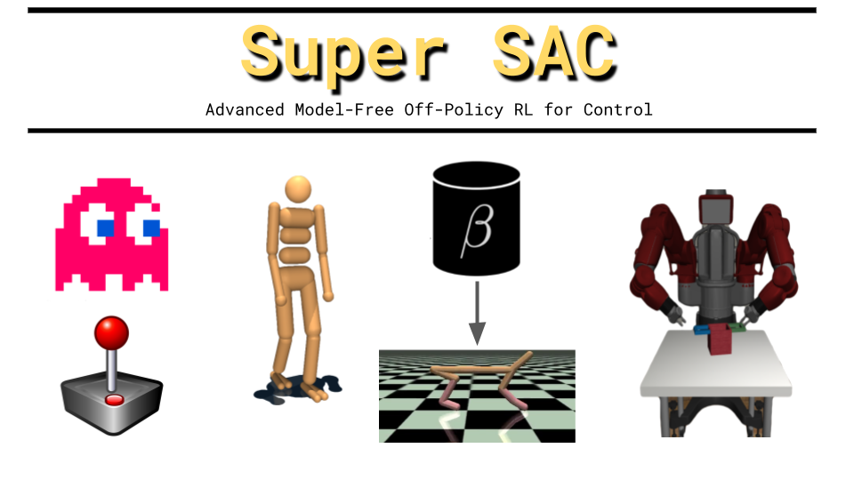
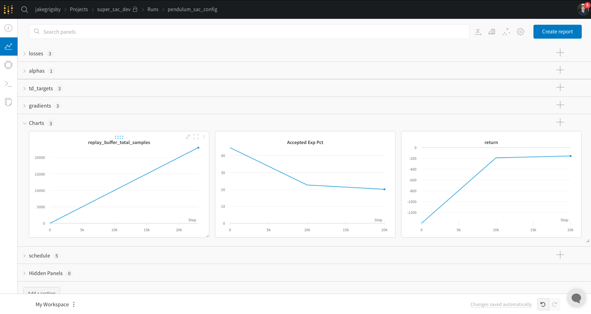

This repository contains the code for a PyTorch RL agent that is designed to be a compilation of advanced Off-Policy Actor-Critic variants. It includes elements of **[[DDPG](https://arxiv.org/abs/1509.02971)]**, **[[TD3](https://arxiv.org/abs/1802.0947)]**, **[[SAC](https://arxiv.org/abs/1812.05905)]**, **[[SAC-Discrete](https://arxiv.org/abs/1910.07207)]**, **[[DrQ](https://arxiv.org/abs/2004.13649)]**, **[[DrAC](https://arxiv.org/abs/2006.12862)]**, **[[RAD](https://arxiv.org/abs/2004.14990)]**, **[[SAC+AE](https://arxiv.org/abs/1910.01741)]**, **[[REDQ](https://arxiv.org/abs/2101.05982)]**, **[[CRR](https://arxiv.org/abs/2006.15134)]**, **[[AWAC](https://arxiv.org/abs/2006.09359)]**, **[[SUNRISE](https://arxiv.org/abs/2007.04938)]**, and **[[DrQv2](https://arxiv.org/abs/2107.09645)]**.

### Main Features:
- Dictionary-based observations. This allows for multimodal/goal-oriented states and support for a much wider range of environments. Basic gym envs can be wrapped to return a dictionary with one key.
- Process high-dimensional observations (e.g., images) with a dedicated `Encoder` module designed for each environment **[[DrQ](https://arxiv.org/abs/2004.13649)]**, **[[SAC+AE](https://arxiv.org/abs/1910.01741)]**.
- MaxEnt RL with automatic entropy tuning **[[SAC](https://arxiv.org/abs/1812.05905)]**.
- Continuous and discrete **[[SAC-Discrete](https://arxiv.org/abs/1910.07207)]** action spaces.
- Warmup learning with behavioral cloning from an offline dataset.
- A hybrid version of **[[CRR](https://arxiv.org/abs/2006.15134)]** and **[[AWAC](https://arxiv.org/abs/2006.09359)]** for Offline RL and Offline pre-training.
- Data Augmentation for pixel-based control **[[DrQ](https://arxiv.org/abs/2004.13649)]**, **[[DrQv2](https://arxiv.org/abs/2107.09645)]**, **[[RAD](https://arxiv.org/abs/2004.14990)]**, with regularization **[[DrAC](https://arxiv.org/abs/2006.12862)]**.
- Ensemble of critic networks with the generalized clipped-double-q-trick **[[REDQ](https://arxiv.org/abs/2101.05982)]**.
- Critic-uncertainty exploration incentive **[[SUNRISE](https://arxiv.org/abs/2007.04938)]**.
- Ensembling and weighted bellman updates **[[SUNRISE](https://arxiv.org/abs/2007.04938)]**. 
- Parallel environment collection (with a lot of help from [stable_baselines3](https://github.com/DLR-RM/stable-baselines3)).
-  Value function normalization **[[PopArt](https://arxiv.org/abs/1809.04474)]**.
- N-step Q updates.
- Manual (random noise) exploration **[[DDPG](https://arxiv.org/abs/1509.02971)]** **[[DQN](https://arxiv.org/abs/1312.5602)]**. Noise included in TD target computation **[[TD3](https://arxiv.org/abs/1802.0947)]** and actor update **[[DrQv2](https://arxiv.org/abs/2107.0964)]**.
- Tensorboard and [wandb](https://wandb.ai/site) logging.

### Tutorial:

#### Gym Quickstart
There are two steps to using Super SAC: 
1. Create an `Agent` (`super_sac.agent.Agent`).
2. Use the main loop `super_sac.main.super_sac` to train the agent. 

Super SAC is a very generalized implementation that allows for mixing and matching features from state-of-the-art research. Most of the included algorithms can be recovered as special cases. I'll be the first to admit that this leads to an overwhelming number of hyperparameters that are difficult to organize. To help with this, Super SAC experiments are designed to be managed by [`gin-config`](https://github.com/google/gin-config) files that keep all the key settings together in a readable way.

As a basic example, here is how you can try DDPG, TD3 and SAC on the `Pendulum-v0` gym env:
```bash
cd experiments/gym/
python train_gym.py --env Pendulumv-v0 --config ddpg.gin --name DDPG_Pendulum 
python train_gym.py --env Pendulumv-v0 --config td3.gin --name TD3_Pendulum 
python train_gym.py --env Pendulumv-v0 --config sac.gin --name SAC_Pendulum 
```
The `train_gym` script loads the hyperparameters corresponding to each algorithm from their `.gin` configuration file. The key differences between them are explained with brief comments. An exhaustive explanation of each hyperparameter option is provided at the bottom of this page.

#### Saving and Logging
By default, data is saved in a subdirectory called `.saves/name_number`, where `name` is the name argument that was passed (e.g., "DDPG_Pendulum") and `number` is a counter that increments to keep from overriding past trials with the same name. You can change the save location by setting the `SSAC_SAVE` environment variable (`export SSAC_SAVE=/somewhere/with/more/disk/space`). 

Super SAC also logs training and evaluation metrics to this directory. By default, we log with tensorbaord. You can see the logs by running `tensorboard --logdir saves`. You can also log the same metrics with [wandb](https://wandb.ai/site). The fastest way to set this up is to define the ``SSAC_WANDB_ACCOUNT`` and ``SSAC_WANDB_PROJECT`` environment variables with your wandb username/organization name and project name, respectively. Then add the command line arg `--logging wandb` to the training script call. When you open up wandb you should see something like this:



We also save all of the network weights, which can reloaded with something like:
```python
agent = super_sac.Agent(...same kwargs you used to train...)
agent.load("saves/SAC_Pendulum")
```

#### More Advanced Settings
Hyperparameter changes can let us move beyond standard SAC. For example, we can use a larger ensemble of critic networks to improve sample efficiency with REDQ (`experiments/gym/redq.gin`). Or we can train an ensemble of agents with improved exploration and critic update stability with SUNRISE (`experiments/gym/sunrise.gin`).

#### Environments with Image Observations
The actor and critic networks are basic MLPs that expect a fixed-size state vector. Environments that have more complicated observations rely on an `Encoder` module that takes the observation as input and outputs a representation of the state. For basic gym or dm_control envs, the encoder has no parameters and simply returns the state vector without any changes.

A basic example of non-trivial encoder training can be found in `experiments/minatar`. [MinAtar](https://github.com/kenjyoung/MinAtar) provides simple remakes of Atari games for fast experimentation. Observations are image-shaped arrays, and we wrap the environment such that each step returns a dictionary with that array as one of its values. The `Encoder` take the dictionary, grabs the image, passes it through a tiny CNN and then projects it to a state vector:

```python 
class MinAtarEncoder(super_sac.nets.Encoder):
    def __init__(self, channels, emb_dim=50):
        super().__init__()
        self._dim = emb_dim
        self.conv1 = nn.Conv2d(channels, 16, kernel_size=3, stride=1)
        self.conv2 = nn.Conv2d(16, 16, kernel_size=2, stride=1)

        output_height, output_width = nets.cnns.compute_conv_output(
            (10, 10), kernel_size=(3, 3), stride=(1, 1)
        )
        output_height, output_width = nets.cnns.compute_conv_output(
            (output_height, output_width), kernel_size=(2, 2), stride=(1, 1)
        )
        self.fc = nn.Linear(output_height * output_width * 16, emb_dim)
        self.apply(super_sac.nets.weight_init)

    @property
    def embedding_dim(self):
        return self._dim

    def forward(self, obs_dict):
        img = obs_dict["obs"]
        x = F.relu(self.conv1(img))
        x = F.relu(self.conv2(x))
        x = x.view(x.size(0), -1)
        state = self.fc(x)
        return state
```

Train a standard SAC-Discrete agent on the "Breakout"-style game with:
```bash
python train_minatar.py --config basic_online.gin --game breakout --name breakout_minatar_run
``` 

A very similar formula (with a larger CNN) applies to real Atari games as well (`experiments/atari`). We can also learn from pixels in continuous action environments like the DeepMind Control Suite. This is much more complicated in general, and good performance relies on data augmentation and implementation tricks from RAD, DrQ, and DrQv2. Please refer to `experiments/dmc/drqv2.gin` for hyperparameter details.

#### Behavioral Cloning and Offline RL
Super SAC supports both offline and online learning. While the online updates are based on off-policy policy gradients (PG) as in DDPG/TD3/SAC, the offline updates are based on a blend of AWAC and CRR. The actor is trained to maximize the probability of outputting actions that have greater value than the current policy - as determined by the critic network(s) (nicknamed in the code "Advantage-Filtered Behavioral Cloning" **[[AFBC]((https://arxiv.org/abs/2110.04698))]**). Behavioral Cloning uses the same method but does not filter any samples. The particular implementation details, numerical stability fixes, and advantage-weighted replay buffer trick included here create a significant improvement over most published results. See `experiments/d4rl` for examples on the **[[D4RL](https://arxiv.org/abs/2004.07219)]** offline benchmark. Offline learning works in all domains and with more complicated `Encoder` architectures.

The main training loop has three phases:
 1. Behavioral Cloning 
 2. Offline Learning 
 3. Online Learning 
 
 Using this schedule you can perform imitation learning, pre-training from demonstrations, fully offline learning, or standard online learning. It is also possible to perform AFBC and PG-style policy updates simultaneously during online training. This tends to work better for discrete actions than continuous ones. Another option is to use AFBC during offline pre-training and then switch to PG during online finetuning. The core functionality for this is already included, but learning is pretty unstable due to the change in optimizers/loss-functions. Work on fixing this problem is ongoing.  

### Credits and References:
Please refer to the links at the top of the README for the arXiv pages of all the techniques included in this repository. In addition to the papers themselves, this work has greatly benefited from open-source implemenations, especially: [`denisyarats/pytorch_sac`](https://github.com/denisyarats/pytorch_sac), [`facebookresearch/drqv2`](https://github.com/facebookresearch/drqv2), [`ku2482/sac-discrete.pytorch`](https://github.com/ku2482/sac-discrete.pytorch), and [`MishaLaskin/rad`](https://github.com/MishaLaskin/rad). Much of the core code was originally based on my implementations in [`jakegrigsby/deep_control`](https://github.com/jakegrigsby/deep_control).

------------------------------------------------------------------------------------------------------------------------------------------------------------------------------------------------------------------------------------------


## Hyperparameter Details
*This information is liable to be slightly outdated until I set up a proper documentation site.*

 Most settings can be freely mixed and matched, but there are notable dead-ends with incompatible or unimmplemented behavior. As one example, you currently can't use offline learning with deterministic policies becasue the loss function is probabilistic. I am working on hparam verification heuristics to alert users to these kinds of issues.


### Super SAC Agents (`agent.Agent`)

**`act_space_size`**: `int`: Size of the action space. Either the dimension of the action vector (in continuous envs) or number of discrete action choices.

**`encoder`**: `nets.Encoder`: Encoder module. Always define new encoders by inheriting from `nets.Encoder` and implementing the forward pass and `embedding_dim` property method. Actor and critic networks are constructed to take a state vector of size `encoder.embedding_dim`.

**`actor_network_cls`**: `nn.Module callable` : Actor network architecture module. You probably want `nets.mlps.ContinuousStochasticActor` (SAC-style MaxEnt), `nets.mlps.ContinuousDeterministicActor` (TD3-style exploration), or `nets.mlps.DiscreteActor`.

**`critic_network_cls`**: `nn.Module callable` : Critic network architecture module. You probably want `nets.mlps.ContinuousCritic` or `nets.mlps.DiscreteCritic`. If implementing a custom architecture, note that a key difference between continuous and discrete learning is that continuous critics take the state and action as input and output a scalar while discrete critics take only the state as input and output the value for each possible action.

**`discrete`**: `bool`: Using discrete actions True/False.

**`ensemble_size`** : `int` : The size of the SUNRISE-style ensemble. We create separate actor and critic(s) for each ensemble member. Exploration actions are sampled by either randomly picking an actor or evaluating each actor for high UCB actions (see `ucb_bonus` param below). Evaluation actions take the mean of the mean of each ensemble actors' action distribution. This has a significant effect on runtime.

**`num_critics`** : `int` : Number of critics per ensemble member. TD3 introduced clipped-double-q-learning, where we train two critics and use the min of their predictions to reduce overestimation bias. Super SAC generalizes this concept to any number of critics in order to implement REDQ. Increasing beyond 2 generally increases sample efficiency, but performance tends to saturate ~10. This has a significant effect on runtime.

**`ucb_bonus`** : `float` : If greater than 0.0, we enable UCB-based exploration as in SUNRISE. Each actor in the ensemble is queried for an action. The action we ultimately select is based on which one maximizes `mean(Q_{ensemble}(s, a)) + ucb_bonus * std(Q_{ensemble}(s, a))`. Raising this parameter puts more emphasis on uncertain actions. Note that this has no effect if `ensemble_size = 1`, because the one actor will always have the preffered action.

**`hidden_size`** : `int` : Hidden size of actor and critic network architectures. This is passed to the `actor_network_cls` and `critic_network_cls` constructors.

**`auto_rescale_targets`** : `bool` : Enables the creation of PopArt normalization layers for critic outputs. If you are familar with PopArt please note that you also need to set `pop=True` in `super_sac.main.super_sac` to get the training behavior you are expecting. (This is the "Art" portion).

**`log_std_low`** and **`log_std_high`** : `float` : Log standard deviation stabilizers passed to `actor_network_cls`. Only relevant for `nets.mlps.ContinuousStochasticActor` implementation. If unsure, `-5.` and `2.` are safe choices.

**`adv_method`** : `str` : Choices are ["mean", "max"] for continuous actions (`discrete = False`) or ["indirect"] for discrete ones. This toggles the value estimation method in advantage-filtered behavioral cloning updates. "mean" says the value of the current policy is the mean of a few action samples, while "max" is more conservative and says it is the max value of those samples. See `adv_estimator.py` for details. This is discussed in the CRR paper.

**`beta_dist`** : `bool` : Swaps the default Tanh-squashed gaussian actor distribution for the Beta distribution ([Paper](http://proceedings.mlr.press/v70/chou17a.html)). This is passed to `actor_network_cls` and is not relevant for deterministic or discrete policies. Note that this is one of the least-tested features of this project because it is not used in the reference learning curves I use as regression tests. It runs fine but its benefit over the default is unknown; I'm working on testing this on a large number of envs.

### Main Training Loop (`main.super_sac`)
#### Required Args:
**`agent`** : `agent.Agent` : Agent object (see above).

**`buffer`** : `replay.ReplayBuffer` : Data replay buffer. See `experiments/` for how to build and pre-load a buffer with offline data. Note that we implement prioritized experience replay even if prioritized sampling isn't used. 

**`train_env`**, **`test_env`** : `gym.Env` : The gym-style environment interface. All environments need to have dictionary observations. If that isn't already true for your env, see `wrappers.SimpleGymWrapper` for typical float32 state-based gym envs and `wrappers.Uint8Wrapper` for pixel-based envs. Both turn the observation into a dictionary of `{'obs' : obs}` that can be processed by a `nets.Encoder`. The `experiments/` training scripts have several examples.


#### Learning Schedule Params:
**`num_steps_offline`** : `int` : How many offline learning steps to take. Each offline step does *not* interact with the `train_env` and performs `learning.critic_update` and `learning.offline_actor_update`.

**`num_steps_online`** : `int` : How many online learning steps to take. This happens *after* any offline steps (for finetuning). Each online step performs `learning.critic_update`, and `learning.offline_actor_update` (if `use_afbc_update_online = True`) and/or `learning.online_actor_update` (if `use_pg_update_online = True`). There is also a `learning.alpha_update` if we're using MaxEnt RL (`alpha_lr > 0`).

**`afbc_actor_updates_per_step`** : `int`: How many `learning.offline_actor_update` (AFBC) steps to perform per offline training step. Also used during online training steps if `use_afbc_update_online = True`.

**`pg_actor_updates_per_step`** : `int` : How many `learning.online_actor_update` (policy gradient) steps to perform per online training step if `use_pg_update_online = True`. There is not a way to perform PG updates during offline training due to Q-function overestimation error.

**`critic_updates_per_step`** : `int` : How many `learning.critic_update` calls per training step. Some methods like REDQ greatly increase this parameter for sample efficiency.

**`use_afbc_update_online`** : `bool` : True/False use *filtered* behavioral cloning (offline-style) update during online training steps. As an example AWAC would set this to True and `use_pg_update_online = False`.

**`use_pg_update_online`** : `bool` : True/False use policy gradient actor update during online training steps/

**`transitions_per_online_step`** : `int` : How many environment transitions to collect per online training step. The relationship between this parameter and values like `offline/online_actor/critic_updates_per_step` determines the replay ratio. Note that this probably needs to be considered when making learning curves based on online sample efficiency (e.g., multiply the x-axis by this value).

**`infinite_bootstrap`** : `bool` : Manually override `done` signals from the environment when the episode timestep is equal to `max_episode_steps`. This is useful when envs have arbitrary time limits (many gym and dm_control envs do). However, there is a (small) chance of edge cases where the episode actually should have ended (due to failure) but we are ignoring the signal because it happened to occur exactly when the time limit kicks in.

**`ignore_all_dones`** : `bool` : Manually override every `done` signal from the environment to False. This is useful when the env terminates for arbitrary reasons in an unpredictable amount of time that cannot be covered by `infinite_bootstrap`. This does not apply to most traditional benchmarks.

**`max_episode_steps`** : `int` : Maximum steps per training and evaluation episode. This is arbitrary unless the env has an explicit time limit, in which case this should be set <=  that time limit... possibly with `infinite_bootstrap = True`.

*Helpful debugging information about when each kind of update is being performed can be found in the `scheduling/` section of the log files.*

#### Optimization Params
**`batch_size`** : `int` : Batch size used in all learning updates.

**`reuse_replay_dicts`** : `bool` : *When possible* limit cpu --> gpu data movement by reusing the same replay buffer samples in actor and critic updates. This is probably what you are expecting if familiar with standard DPPG/TD3/SAC style updates. It is not always possible, for example when doing offline RL with the PER trick where the critics sample uniformly from the buffer while the actor samples with prioritized replay. There are heuristics in the training loop to prevent this from becoming an issue; you can safely set this to `True` in all cases unless there is a specific reason not to.

**`actor_lr`**, **`critic_lr`**, **`encoder_lr`**, **`actor_clip`**, **`critic_clip`**, **`encoder_clip`**, **`actor_l2`**, **`critic_l2`**, **`encoder_l2`** : `float` : Are the optmizer learning rates, grad clipping, and l2 regularization parameters. Note that the encoder parameters have no effect when using fake encoders (classic state-based gym envs).

**`pop`** : `bool` : True/False to use the "Pop" part of PopArt value normalization.

#### Exploration Params
**`init_alpha`** : `float` : Initial value of MaxEnt coefficient alpha. `init_alpha = 0, alpha_lr = 0` effectively turns off MaxEnt RL (you probably want to set `use_exploration_process = True`). `init_alpha > 0, alpha_lr = 0` disables automatic entropy tuning - leaving the alpha value fixed.

**`alpha_lr`** : `float` : Learning rate for the alpha entropy parameter. Set this to 0 to disable automatic entropy tuning.

**`target_entropy_mul`** : `float` : If `alpha_lr > 0`, we use automatic entropy tuning to adjust alpha until the policy entropy reaches `target_entropy_mul * heuristic_entropy_val`, where `heuristic_entropy_val` is the literature-standard rule. If the dimension of the action space is |A|, for continuous actions that would be -|A| while discrete actions use -log(1 / |A|) * .98. This is more arbitrary than is sometimes acknowledged... those work for Gym MuJoco/dm_control and Atari, respectively, but are less tested outside those domains.

**`use_exploration_process`** : `bool` : True/False to use heuristic exploration noise. This creates an Epsilon-Greedy process for discrete actions and Gaussian Noise process for continuous actions. If you are using MaxEnt RL (`init_alpha > 0`) with continuous actions this should almost certainly be turned off, because the noise is also used in learning (TD3-style). There are reasons to use both MaxEnt and Epsilon-Greedy with discrete actions if worried about premature entropy collapse. The MaxEnt portion prevents actor distribution collpase during updates while the exploration noise improves sample diversity.

**`exploration_param_init`** : `float` : Randomness schedule initial value. For EpsGreedy (discrete) this is the probability of taking a random action, for GaussianNoise (continuous) this is the std dev of the noise vector.

**`exploration_param_final`** : `float` : Final randomness schedule value (see `exploration_param_init`).

**`exploration_param_anneal`** : `int` : How many *environment transitions* to anneal the exploration param from its initial to final value (see above). Note that this does not directly correspond to learning updates. The schedule progresses by `transitions_per_online_step` per `step`. 

**`exploration_update_clip`** : `float` : Clip random exploration noise for continuous actions *inside of learning updates*. This is nearly equivalent to TD3's "c" parameter, except that it is also used in the actor update (as in DrqV2).

#### General RL Params

**`target_critic_ensemble_n`** : `int` : The "N Ensemble Size" parameter from REDQ. Defines the size of the subset of the critic ensemble that is used to compute temporal difference targets. Standard clipped-double-q learning will have 2 critics and set this to 2 (using the min of both critics in the target).

**`gamma`** : `float` : Standard MDP discount factor.

**`mlp_tau`** : `float` : Standard polyak-averaging coefficient for target network updates. Only applies to actor and critic MLPs.

**`encoder_tau`** : `float` : Polyak-averaging coefficeint for target encoder network upates. This is sometimes set higher than `mlp_tau` when the encoder has more parameters and is more stable (e.g., DrQ).

**`target_delay`** : `int` : Critic updates between target updates. TD3 popularized setting this to something higher than 1, for stability.

**`n_step`** : `int` : N-step Q targets. Empirically eases critic learning despite being very off-policy in a way that single-step learning is not. For this reason, using `n_step > 1` can make the size of the replay buffer a more important setting.

**`weighted_bellman_temp`** : `float` : This is a parameter from SUNRISE that changes the extent to which we penalize uncertain critic updates. Not relevant when `Agent.ensemble_size = 1` or set to zero. When in doubt set to `None`, which will save time by skipping the computation even when `Agent.ensemble_size > 1`.

**`weight_type`** : `str` : Approach to weighted bellman update scaling. `"sunrise"` directly copies the SUNRISE equation, while `"softmax"` uses the uncertainty over the next_state Q-values and softmax-weights the standard deviations.

**`afbc_per`** : `bool` : Enable effective-batch-size correction trick during `learning.offline_actor_update` calls. This samples from the buffer according to previously estimated advantage, making it more likely that we will sample actions that will not be masked by the behavioral cloning filter. Improves stability and sample efficiency by more efficiently using the majority of each batch. Refer to [this paper](https://arxiv.org/abs/2110.04698) for details. Not relevant when doing pure PG online learning.

**`augmenter`** : `augmentations.AugmentationSequence or None` : None disables data augmentation. See `experiments/dmc/train_dmc_from_pixels.py` for an example of image-based augmentation. Augmentation is implemented similar to RAD where any any randomness is shared across both state  and next_state. Multiple augmentations can be chained together (see `augmentations.py`).

**`encoder_lambda`** : `float` : Coefficient for encoder augmentation-invariance regularization loss. See `learning_utils.encoder_invariance_constraint`.

**`actor_lambda`** : `float` : Coefficient for actor augmentation-invariance regularization loss. See `learning_utils.actor_invariance_constraint`.

**`aug_mix`** : `float` : [0, 1] fraction of each batch that augmented. For very disruptive augmentations this should probably be set < 1 so that the encoder has seen observations that look like the evaluation (un-augmented) env.


#### Misc Params
**`render`** : `bool` : True/False render evaluation rollouts.

**`eval_interval`** : `int`: How often (in full training steps) to evaluate the agent.

**`eval_episodes`** : `int` : Evaluate the agent for this many episodes (of steps <= `max_episode_steps`) and log the mean return.

**`logging_method`** : `str` : Either `"wandb"` or `"tensorboard"`.

**`wandb_entity`** : `str` : wandb 'entity' (your account username or organization name). N/A if using tensorboard logging, and will throw a helpful error if needed but undefined. By default, Super SAC will try to find this for you with the environment variable `SSAC_WANDB_ACCOUNT`.

**`wandb_project`** : `str` :  wandb project. N/A if using tensorboard logging, and will throw a helpful error if needed but undefined. By default, Super SAC will try to find this for you with the environment variable `SSAC_WANDB_PROJECT`.

**`base_save_path`** : `str` : Root save directory for network weights and log files. Defaults to "./saves", but Super SAC will check the environment variable `SSAC_SAVES` first. 

**`name`** : `str` : All the data for this run will be saved at `os.path.join(base_save_path, name_idx)`, where `idx` is a number that is generated to keep this run unique in case of name clashes (e.g., multiple random seeds).

**`save_to_disk`** : `bool` : True/False save agent network weights to disk.

**`log_to_disk`** : `bool` : True/False log metrics to disk.

**`log_interval`** : `int` : How often (in full training steps) to log metrics.

**`save_interval`** : `int` : How often (in full training steps) to save network weights.

**`verbosity`** : `int` : verbosity > 0 will print a progress bar and summarize key hparams before training begins. This helps catch hparam mistakes early
